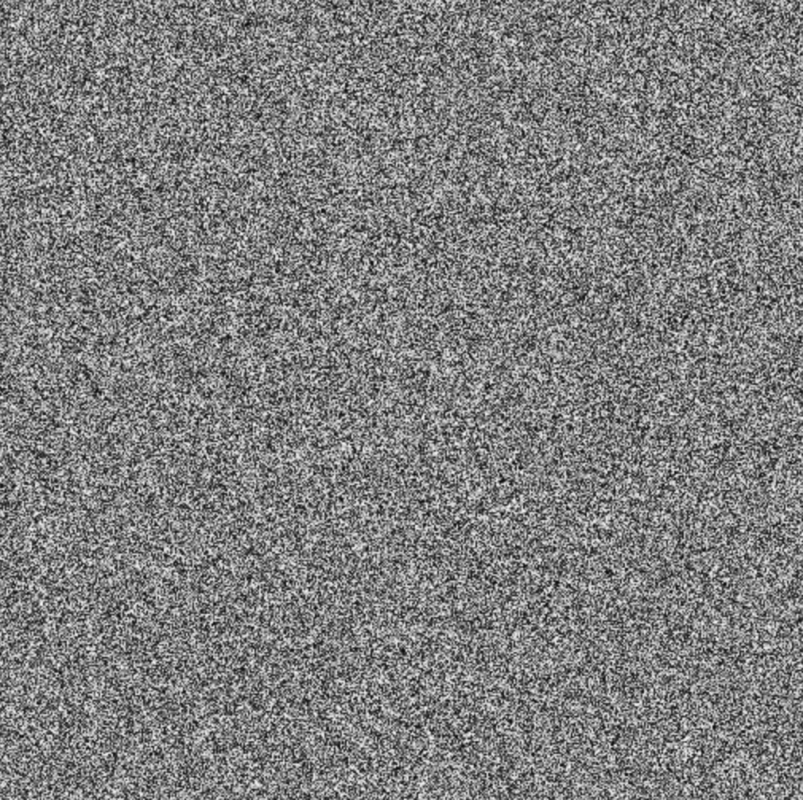
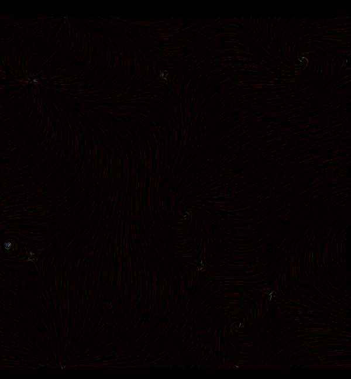
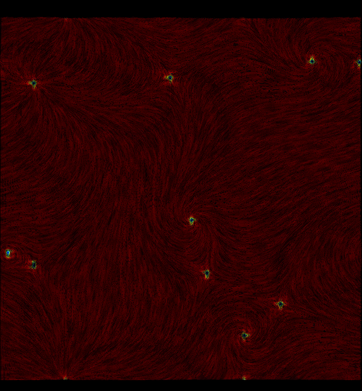

# 【數位美術】Krenz 構成十期-01-趨勢

> 2023-12-08 · 繪圖 · GP 5 · 來源 https://home.gamer.com.tw/artwork.php?sn=5843301

就如同我在[序](https://medium.com/maochinn/數位美術-krenz-構成十期-序-cd7044e31c31)中講得一樣，我認為有了動態才有構成，那麼首先，動態是什麼，或者說，**畫圖為甚麼需要動態**？

  

K大給出的解釋是，專家通常會精心設計畫面讓觀眾容易閱讀，具體的來說就是畫面中要有容易辨識的趨勢可供參考。反過來說，如果畫面中沒有明顯的趨勢，通常就會覺得畫面沒有**動態，**因此要有動態的先決條件是畫面要**容易閱讀。**

而類似的解釋在還沒上課過的我來說，其實看過很多，但是總有種雲裡霧裡的感覺，因為有很多抽象的詞彙在裏頭，讓你彷彿有點感覺，但是卻無法實質的說出來，因此在上完課後我會嘗試說明白這些概念。

  

* * *

首先，我先做一個武斷的定義，所謂**容易閱讀**的畫面就是**整齊**的畫面，反過來說就是如果畫面過於**雜亂**，就會導致難以閱讀，難以閱讀並不意味著無法閱讀，舉個極端的例子來說，也就是雜訊(noise)圖，雖然只要你專心還是有辦法閱讀，但是不知從何看起，或者更進階一點說，你不知道你的視線要怎麼在畫面中移動。

圖一 雜訊

  

那相同的雜訊，如果我們為她添加一些**趨勢**，你會發現儘管乍看之下仍是雜訊，但是圖二容易閱讀的多了，因為這些雜訊對齊了某種規則，讓人可以快速的感受並且理解到畫面。

圖二 用不同密度視覺化的颱風動態

  

事實上這是我以前visualization的作業，從圖二上可以發現我是在畫面上畫上一堆短曲線，而每段短曲線都是一段雜訊，而圖二下只是將線條的密度增加，因此本質上仍是一堆雜訊，但是顯然的，兩相比較之下，圖二更加**整齊**，也更**容易閱讀**，或許你也可以發現視線可以自然的畫面中移動**。**

換句話說，我認為如果要讓畫面容易閱讀，那麼在畫面上的點、線、面組成的圖形應該要符合某種規律，這個規律可能是我上面舉例的，漩渦，或是一條曲線，甚至是無聊的格線。

  

* * *

回到比較正常的圖畫，來看看米山舞老師的實例

圖三 米山舞老師的作品

  

如果撇除掉透視、色彩等等，事實上畫面就是一堆大量的色塊，也就是大量的2D圖形，但是觀眾不會感到雜亂，或者至少感受到亂中有**序**，也就是說我們雖然不太容易直接看出背後的**規律**，但是我們可以感受到某種**趨勢**，而正是有這股趨勢才不會覺得畫面**雜亂**，也才**容易閱讀**。

  

換句話說，如果創作時希望畫面容易閱讀，或者有人會說把畫面整理**乾淨**，我們就必須要主動地去安排畫面中的圖形，這包含了所有的點、線、面，而事實上，所謂的感覺到畫面有**動態**的前提就是畫面不能**雜亂**。

  

* * *

那這時後就要來看看反例，這是當初的透視課作業，可以假定這張的透視沒有太大的問題，雖然乍看之下沒有非常雜亂，但是總有種更種元素散落在畫面中的感覺，並沒有明顯的趨勢。

  

[完整版請移至Medium觀看(排版也比較好閱讀)](https://medium.com/maochinn/數位美術-krenz-構成十期-01-趨勢-c6d0ada61e08#bb71)

  

\--

如果覺得有幫助到你或是想支持我歡迎給我GP或是贊助！

  

\--

最近慢慢再複習課堂的回放，可能是因為構成課本身的知識點相對分散，整理起來相對麻煩，

因此這次構成的筆記應該會採較短且多篇的形式進行，

不然之前一次寫落落長未必有人會想看

$('article.c-text img').load(function () { // 表格內圖片大於表格寬時，設為 100% if ($(this).parents('table').length != 0) { if ($(this).width() >= $(this).parents('td').width()) { $(this).width('100%'); } else { $(this).width($(this).width() + 'px'); } } });
