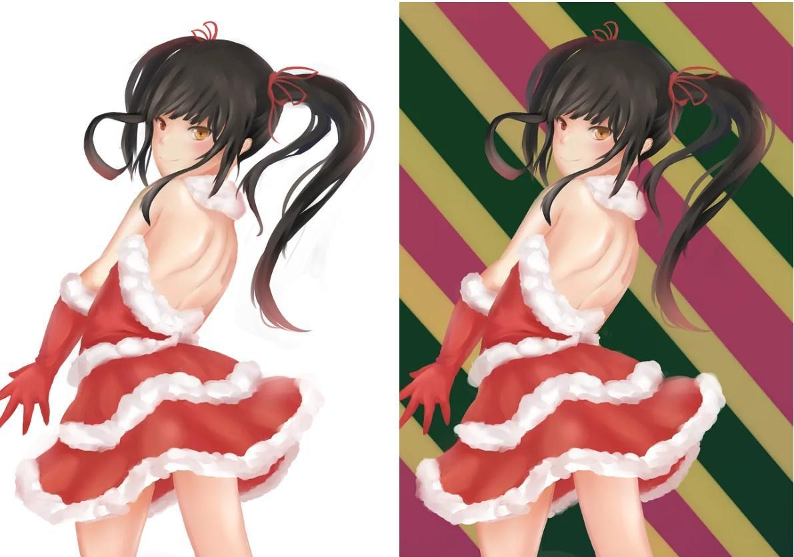
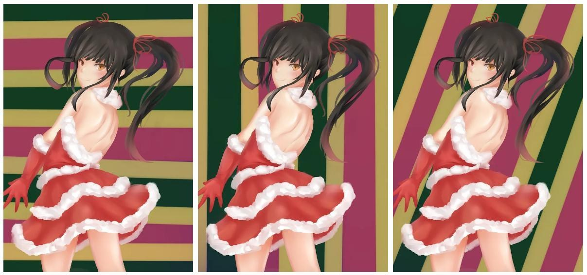

# 【數位美術】動態 — 斜線與直線

> 2024-01-21 · 筆記 · GP 6 · 來源 https://home.gamer.com.tw/artwork.php?sn=5869126

動態的其中一種我稱之為動感，直白地說就是感覺到整體畫面不穩定，而其中一個常見的成因就是畫面中有大量的斜線，或者反過來說，如果畫面中有大量的水平線通常會讓整體有穩定的感受，甚至垂直線相比斜線都有更加穩定，因此我將感受到動感與否粗暴理解為畫面是否有大量的斜線，反之，如果畫面中是大量的直線(非斜線：垂直線、水平線)則較無動感。

  

事實上，上述的一些描述在許多教學或是攝影的書中都有提過，但是我在沒有自己嘗試過之前總會認為那些舉例都只是一些特例，平常看得插圖似乎都與這沒有關係，這就導致自己在創作時並不會特別考慮、意識到這些事情，因此，這邊就拿我初學時的圖來舉個簡單的例子好了。

圖1.a 無背景的聖誕狂三。圖1.b 加上背景的聖誕狂三。

  

右圖是當時不知道背景要畫甚麼就隨便畫的，光是這樣就可以感受到，右圖的調性跟左圖不同，當然這與整張圖的資訊量不同有關，但是如果將背景做不同程度的旋轉，可以注意到，儘管畫面的內容完全相同，但是只因為背景是直線或是斜線就可以導致不同的感受，這是因為背景的對比非常強烈，因此背景的線條的存在感與角色的輪廓、光影等元素差不多。

  

也就是說，無論是背景或是角色，如果只單純看線條的話，整個畫面的大多數都是由斜線所構成，因此，整個畫面有動感，當然，直接這樣說沒有說服力，動感是比較出來的，因此我們將背景稍微旋轉一下。

圖1.c 水平背景的聖誕狂三。圖1.d 垂直背景的聖誕狂三 。圖1.e 斜線背景的聖誕狂三

  

稍微比較可以發現相對於左(圖1.c)與中(圖1.d)，右(圖1.e)從右上至左下的的背景讓整個畫面更加的有動感，這是因為角色的的整理趨勢也是右上至左下，與背景一致，也就是整張圖的線條的調性一致，一樣的不穩定，因此該圖的動感會是最強的，但是如果跟原圖(圖1.b)相比，可以發現整個畫面相對的不平衡，因為所有線條都是從右上至左下。

  

反之，原圖(圖1.b)中背景的線條是左上到右下，剛好與角色的線條對稱，因此整個畫面既平衡要有動感，因為畫面中有兩種對稱的斜線互相平衡，而斜線本身又會產生不穩定的感受。當然如果單論動感的程度圖1.e則較強些。

  

另外，(圖1.c)的背景中的水平線雖然讓畫面更加的穩定，但是也可以發現，因為與角色的線條既不相同又不對稱，兩者調性完全不同，且線條的數量強度差不多，分不清楚主次關係，就會導致感覺背景特別突兀，因為整體畫面的趨勢混亂。

  

[完整版請移至Medium觀看(免費！排版也比較好閱讀)](https://medium.com/maochinn/數位美術-動態-斜線與直線-b6465aacefa8#38e7)

  

\--

如果覺得有幫助到你或是想支持我歡迎給我GP或是贊助！

  

\--

構成筆記比想像中難寫，主要是因為許多知識點有點零散，

許多知識點要靠自己腦補組成一個脈絡，

而腦補出來的東西要與課程沒有直接相關，

因此發現好像不能算是構成筆記，只好單獨開一個系列出來，

這樣構成筆記就可以不用解釋一些概念。

  

年前看能不能發布得比較快，

手邊寫的量都夠再發兩篇了，但是真的有夠難整理。

  

以上!

$('article.c-text img').load(function () { // 表格內圖片大於表格寬時，設為 100% if ($(this).parents('table').length != 0) { if ($(this).width() >= $(this).parents('td').width()) { $(this).width('100%'); } else { $(this).width($(this).width() + 'px'); } } });
