# 【耍廚】why-STUDIO 校服時崎狂三｜約會大作戰 美少女系列002

> 2024-04-27 · 收藏 · GP 3 · 來源 https://home.gamer.com.tw/artwork.php?sn=5923523

看看都什麼時間了

又到開箱的時間了

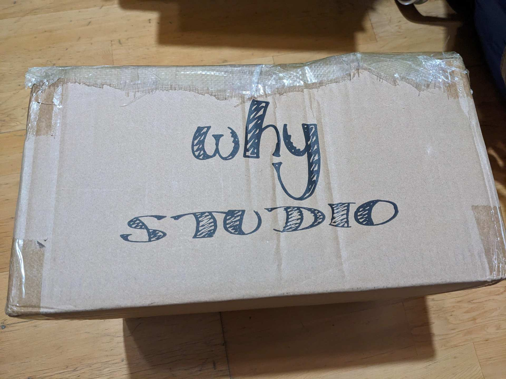  
打開就可以看見一樣是用黑色的類似海綿的物質固定的，

這個我就不特別放圖了，似乎中國工作室的包裝都差不多，

可以參考

[【耍廚】約會大作戰 萬聖節 時崎狂三 GK](https://home.gamer.com.tw/creationDetail.php?sn=5229101)

[【耍廚】Mercury(水星) 時崎狂三 泳裝少女系列 第二彈](https://home.gamer.com.tw/creationDetail.php?sn=5739834)

[【耍廚】Pointer bear 時崎狂三 GK 約會大作戰系列 第二彈](https://home.gamer.com.tw/creationDetail.php?sn=5789200)

  

總之拿出來就可以看到老婆了

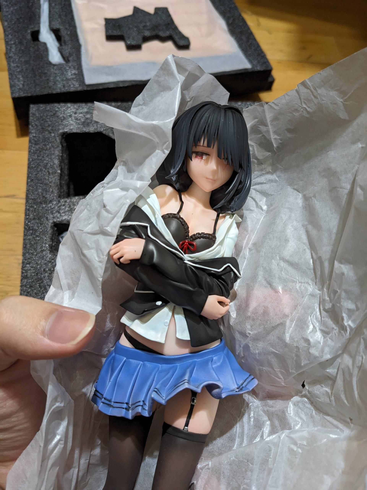

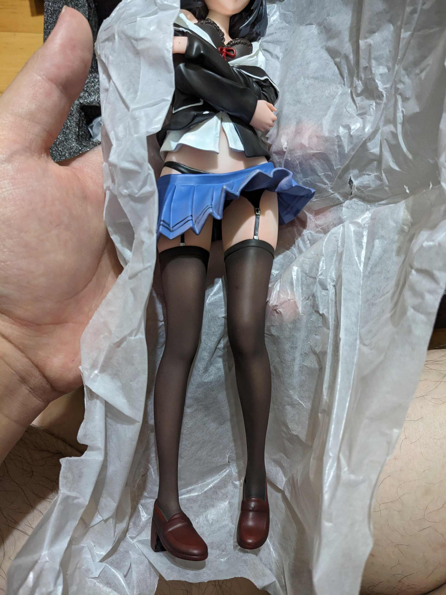  
因為馬尾是分件，但短髮狂三看起來別有風味

還附一個胸章在裡面

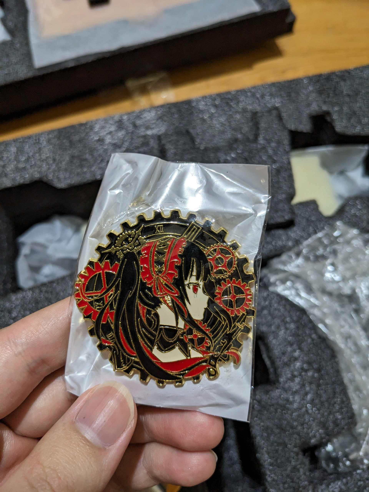  
  

之後把剩下的分件都拿出來就長這樣

可以看到刻刻帝跟書包基本上愛怎麼放就怎麼放

然後真的好胸

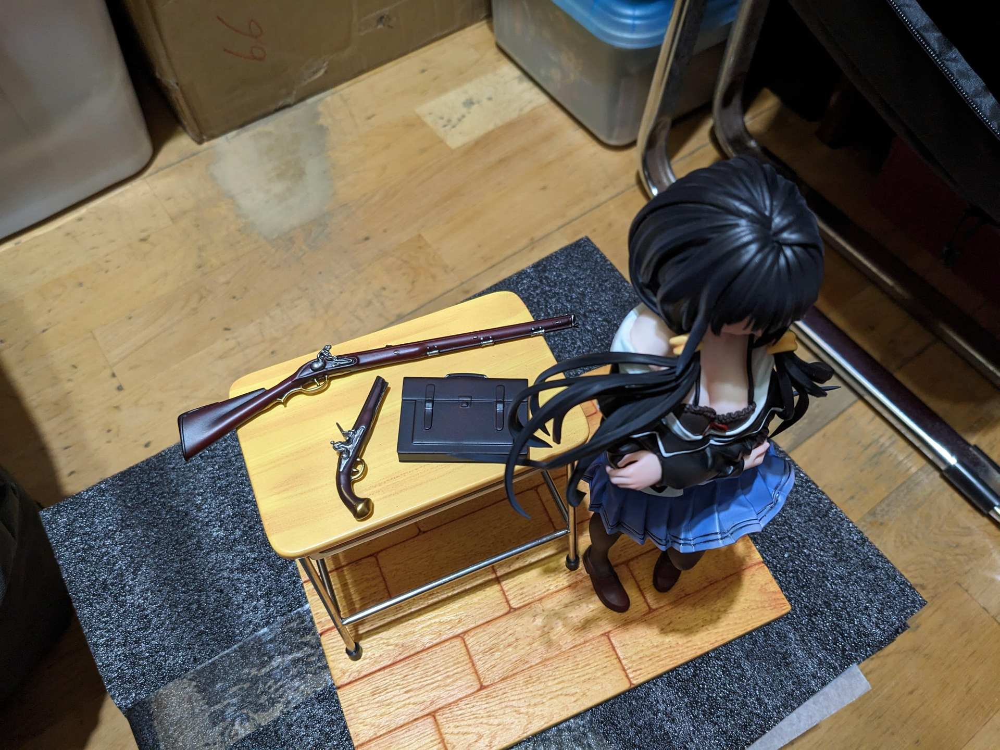  

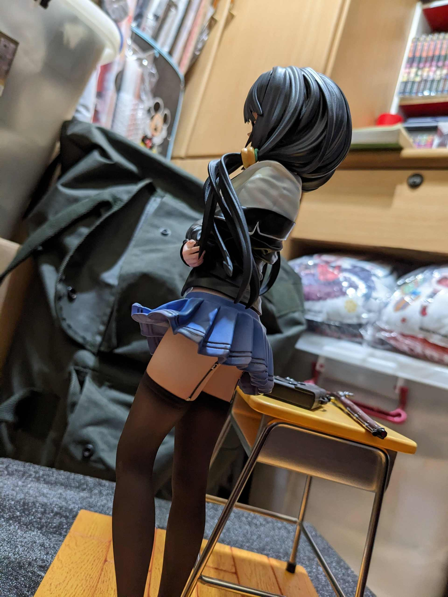  
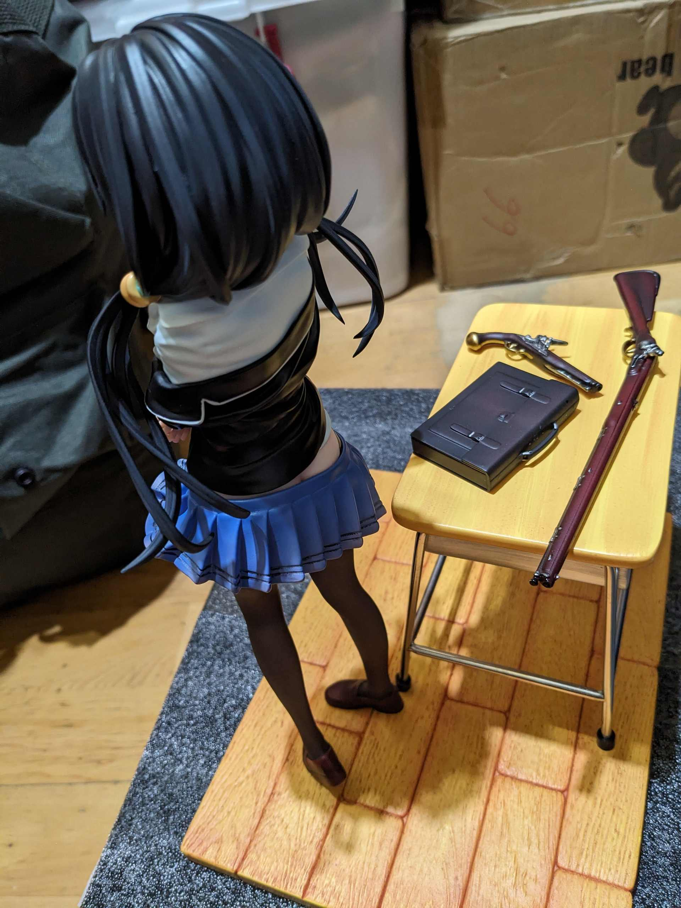  
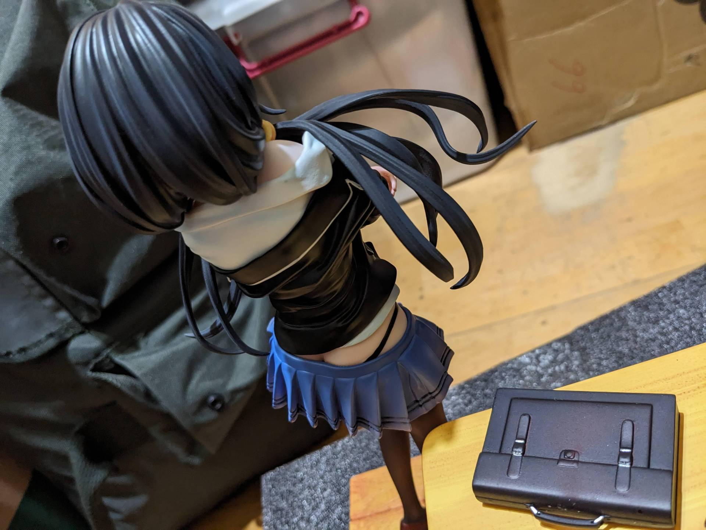  
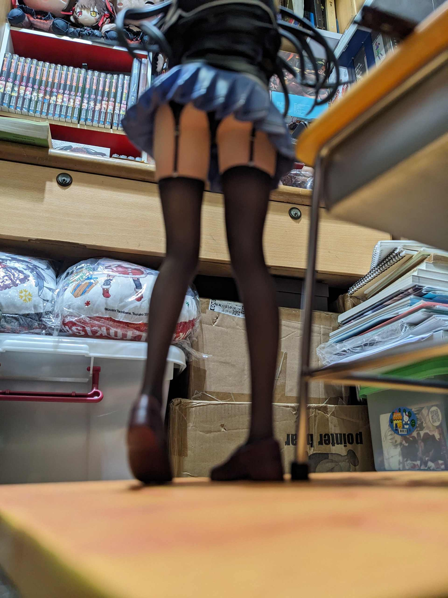  
阿斯

來個特寫

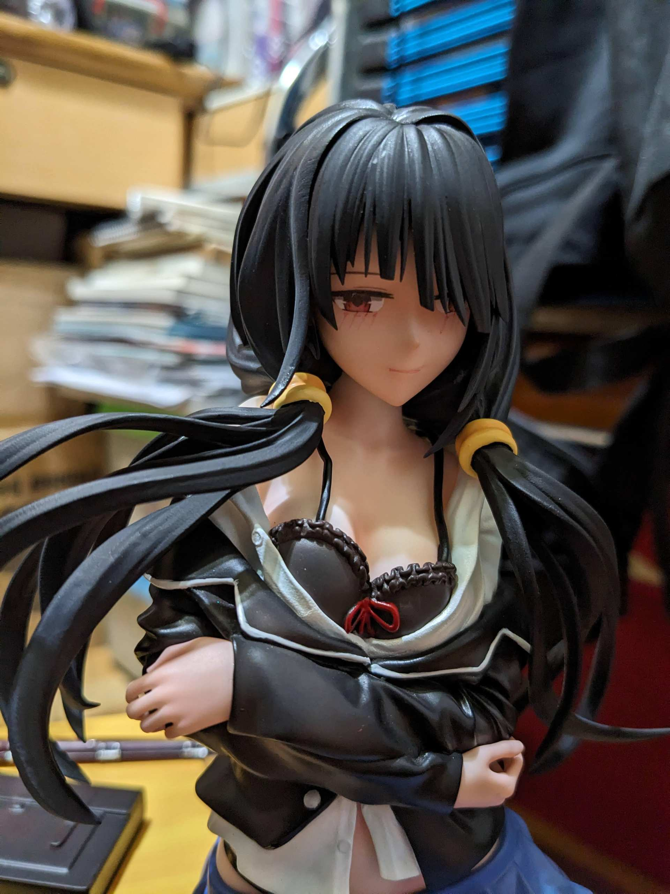  
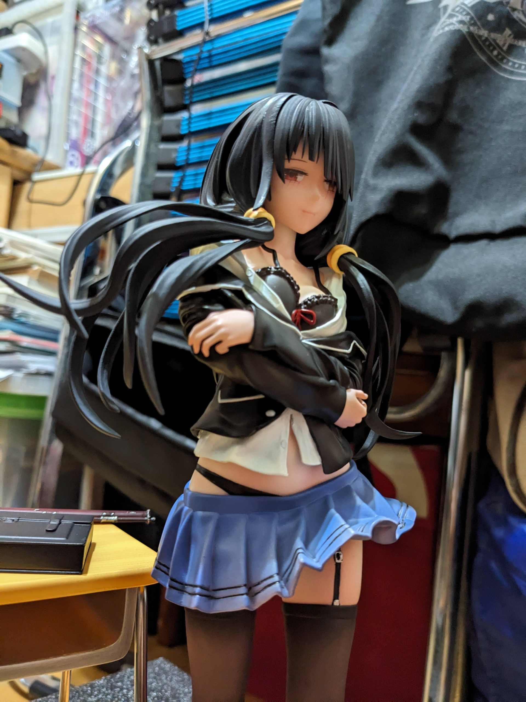

不知道為什麼，這個角度有種脫窗的感覺

  

事實上如果仔細看會發現左邊馬尾連接處有藍綠色的黏土，

是因為他的卡榫做的很鬆，然後弄緊的時候出來出的部分斷了，

(可以參考一開始開箱短髮的時候，那個卡榫又細又脆弱)

因此先拿黏土連接，以後再想辦法

  

有比較才會發現有些廠商用磁吸作卡榫真的比較好

其餘大部分的東西都沒有任何卡榫，只是右腳跟底座有，因此蠻不穩定的

  

總之先放回箱子裡面再看看

以上

  

\--

最近發生一些事比較有時間可以回來寫一些文章，

但短期內還要準備英文，所以還是隨緣更新吧

$('article.c-text img').load(function () { // 表格內圖片大於表格寬時，設為 100% if ($(this).parents('table').length != 0) { if ($(this).width() >= $(this).parents('td').width()) { $(this).width('100%'); } else { $(this).width($(this).width() + 'px'); } } });
