# 【社畜】深圳出差紀錄

> 2024-07-04 · 社畜 · GP 7 · 來源 https://home.gamer.com.tw/artwork.php?sn=5962205

從美國回來後緊接著是中國，講好聽的是這樣，不過這趟我是鬼轉成設備工程師，雖然這個也只是講好聽，實際上應該只是技術員，因為我的背景基本上跟電機、機械無關，又因為設備都在中國，因此必須到深圳才能訓練，因此這次出差的心情可謂複雜，詳細的事情就等有機會再說吧。

  

超級文長注意，強烈建議到[Medium](https://medium.com/@maochinn/雜記-深圳出差紀錄-61295b142f3e)閱讀，排版比較好看

  

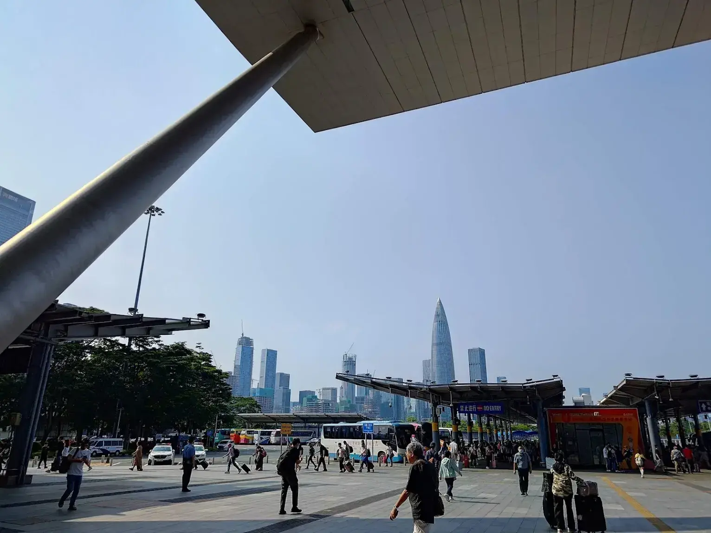  

剛從深圳關出來

  

一大早出發，大概中午就到到香港，然後再坐車到七人座的車進深圳，途中要坐車出關，然後再到深圳的入關處檢查，這邊要徒步進去，如果有辦自動通關就可以比較快，只是這邊要注意台胞證跟本人的特徵有出入的話就會被抓到旁邊問話，可能要拿其他證件還有通話紀錄來證明你是台胞證上的這個人。之後要進龍華前還要換車才能進去。

  

基本上前幾天都在了解環境，包含廠區內刷臉的照片(出勤)、車間內會用到的靜電衣帽(兔裝)、電話卡(SIM卡)、銀行卡(debit card)，只是因為我們這群人人數蠻多的，所以整個弄完需要用掉整個上午，由於中國大多數的服務都要實名制，因此要先有手機號碼，你才能辦卡，辦了卡你才能用各種支付，你也才能比較方便付錢或是買外賣。

  

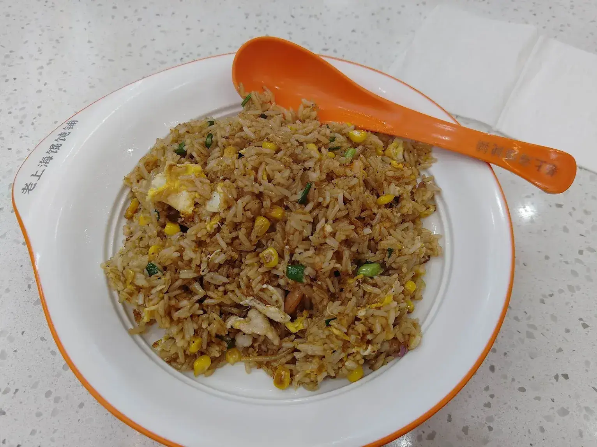  
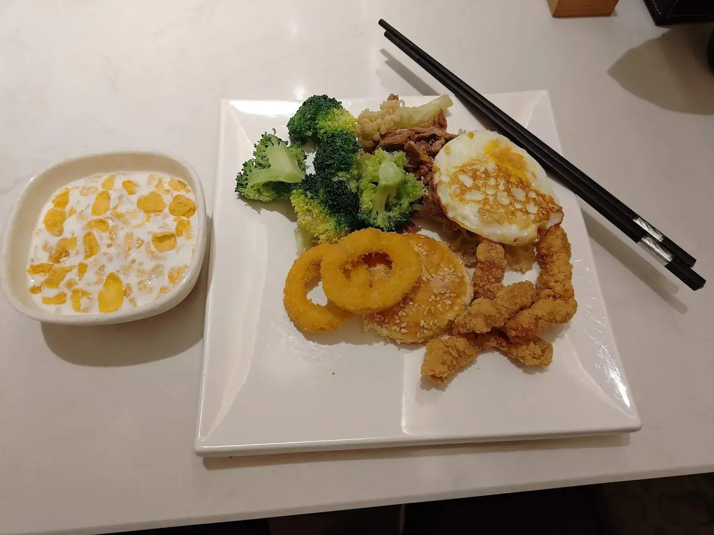

值得紀念的第一天晚餐和第二天酒店附的早餐

  

**第一周**

因為我們來這裡的目的是未來能在印度獨自負責改機(Retrofit)，理想上每個人都要能夠改產線上所有的設備，但是一開始只會讓我們先學其中一種，因為我們幾乎都是沒有相關背景的人，所以在大約一個月的時間將所有人分成好幾組，每一組只負責學一台，雖然有OSS(未來負責在產線上負責維護的)的人有先過來學習，理想上可以教我們一些，但是因為沒有麼義務關係，所以基本上沒有什麼太多交流。

  

總之第一周先我們熟悉整個環境以及負責的機台，舉例來說我被分配到的是富士康(Foxconn)與思榕(Strong)一起開發的SPA(不要問我全名，我問了一個月沒人知道)，簡單來說就是將泡棉貼到產品上面，設備是六軸的龍門，分別是XYZZ軸與兩個吸嘴的R軸，有關手臂的概念可以參考。

  

概念上有點像如下的影片，只是實際上是用吸嘴將泡棉(Foam)取起，然後再壓到要貼的產品上，延遲一段時間確定貼上去時，吸嘴再變成吹氣同時Z軸往上，確保泡棉不會被吸嘴帶起。

  

讓我們先學其中一台是因為理論上自動化設備大同小異，先集中學好一台就比較容易類推其他設備，另外就是實際上要在三周內通過Level 1與Level 2的認證，每個認證有筆試與實操，考試的人是該設備的廠商，事實上，自動化設備大多數不是公司的人在改機，而是請設備對應廠商的人來弄，因為這些設備基本上是這些廠商的商品，因此出問題也是公司要Call廠商來處理。

  

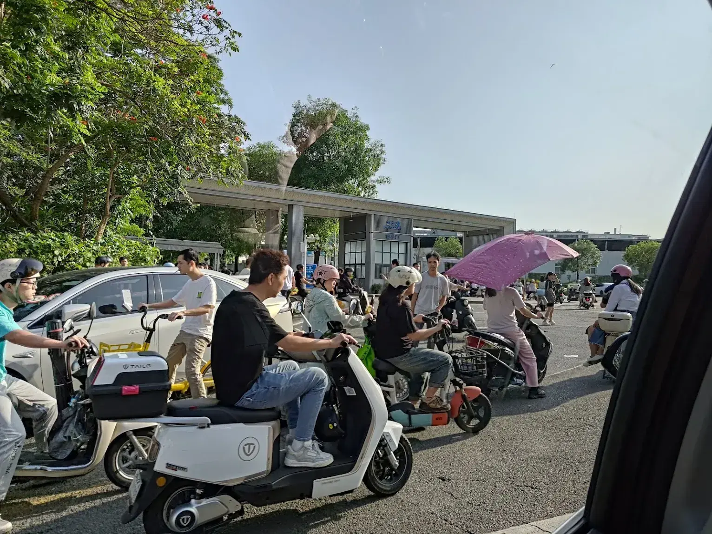

上班時間的廠區內外

  

但說實在，其實大部分時間都蠻閒的，例如在會議室討論，或是在車間聊天，甚至無聊到跑去看別組的HAL點膠機，只是星期六還要上班OAO，因為我們只是出差，制度上仍是照台灣的勞基法，因此週六公司有讓我們報加班，但是公司制度是需要先預先加班申請，在星期六以前讓各級主管簽核過，之後再丟加班確認申請，一樣要讓各級主管簽核過之後才能拿到加班費。

  

另外因為我們的編制是在龍華，因此打卡刷臉都要在龍華廠，但是設備大多在觀瀾廠，因此每天都要搭約來回莫1小時半的車往返，第一周的心得大概是覺得整件事情公司沒有規劃或是想清楚，許多安排是基本上可以說是朝令夕改，可謂是無所適從，但說實在的這絕不是基層主管的問題，這一定是從上至下的問題，包含上層不合理的目標訂定，中層為了滿足上層的要求只能作思慮不周的動態調配，以及下層，也就是我們根本不應該出現在這裡，整串的錯誤才造就這個狀況。

  

基本上中國的同仁大多都是相關背景出身，但是薪資上可能都不到1W RMB，除非加班之類的方式，因此許多在台灣的困境這邊也看的到，例如買房、娶妻之類的，雖然中國的房價應該不到台灣的水準，但是他們的薪資平均也是不到台灣的水準，另外在娶妻上除了駭人聽聞的聘禮之外，女性的確相對過去更加自主，或是講難聽一點就是會挑剔，嫌棄這些賺不多的男性。

  

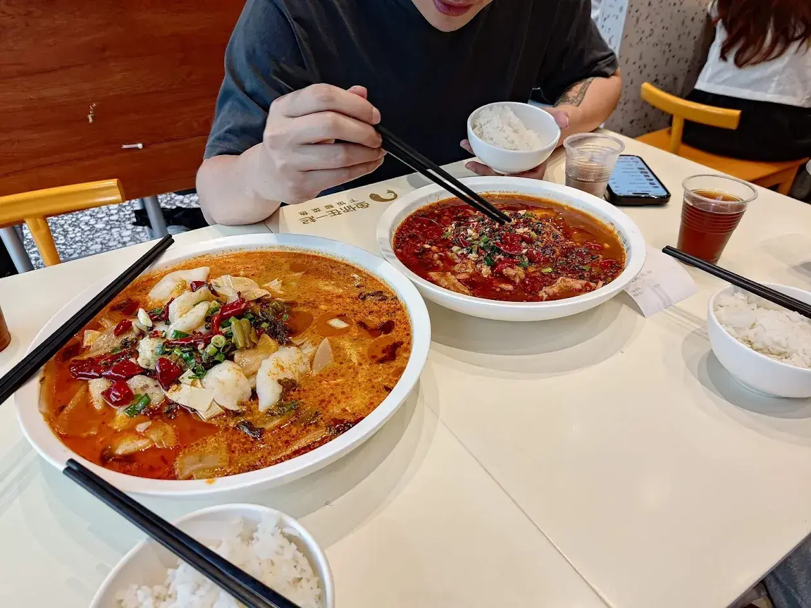

跟中國同事吃酸菜魚

  

另外在念書上，因為他們的高考不只是有錄取的硬門檻，也有名額限制，因此就算考到給定的門檻也會因為排名的關係落榜，但就算如此還是比台灣捲的多，會在學校待到10點，隔天又要6點到，基本上不大可能通勤太長距離，但同時也可以感受到他們所謂的民族自信心，對於各領域的進步相當驕傲，相對的，當然也就會對崇洋媚外不以為然，因此有不少調侃的話，例如：

  

自由美利堅、槍擊每一天

  

除此之外也有聊到當兵，基本上中國的當兵應該是志願役，一定程度上是一件光宗耀祖的事情，同時也有嚴格的限制，例如體格或是不能有刺青等，這跟在台灣很多人要躲兵役的經驗不同，因為在中國想當兵還未必可以當兵。

  

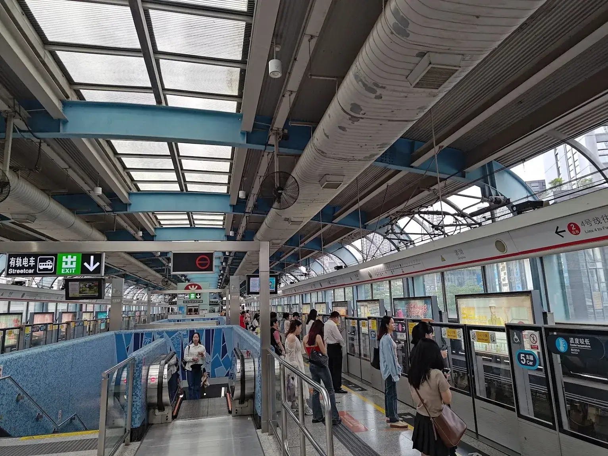

觀瀾地鐵站，基本上跟台灣的捷運感覺差不多

  

雖然周休一日，但是難得來了有一位前輩就帶我坐地鐵去附近轉轉，目的地是壹方天地商場。

  

  

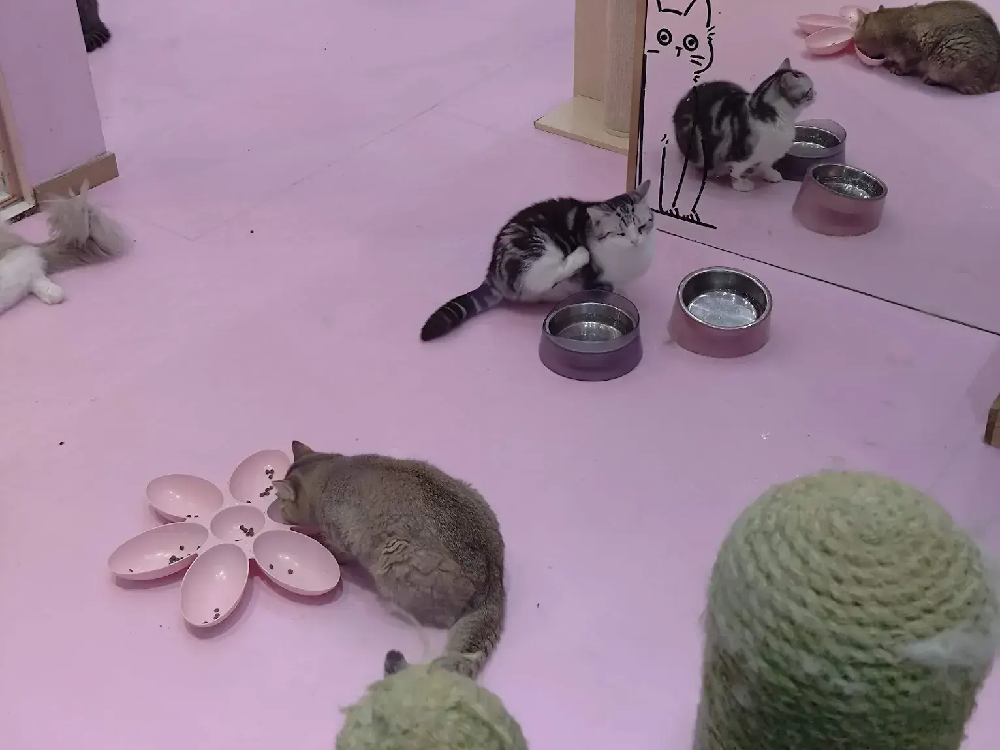

有一間給你嚕貓的寵物店，當然是要錢的，但是看王八蛋的不用錢，商場裡面還有其他動物，有豬、羊跟孔雀等，真的是在中國才有辦法想像可以這樣玩。

  

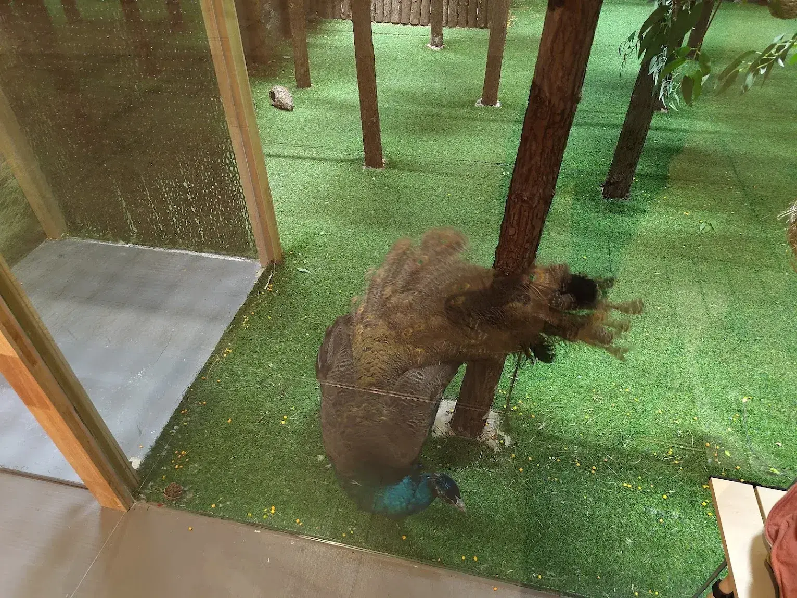

  

然後還會有空間讓你溜小孩，包含沙坑跟水池，一樣，真的是在中國才有辦法想像可以這樣玩。

  

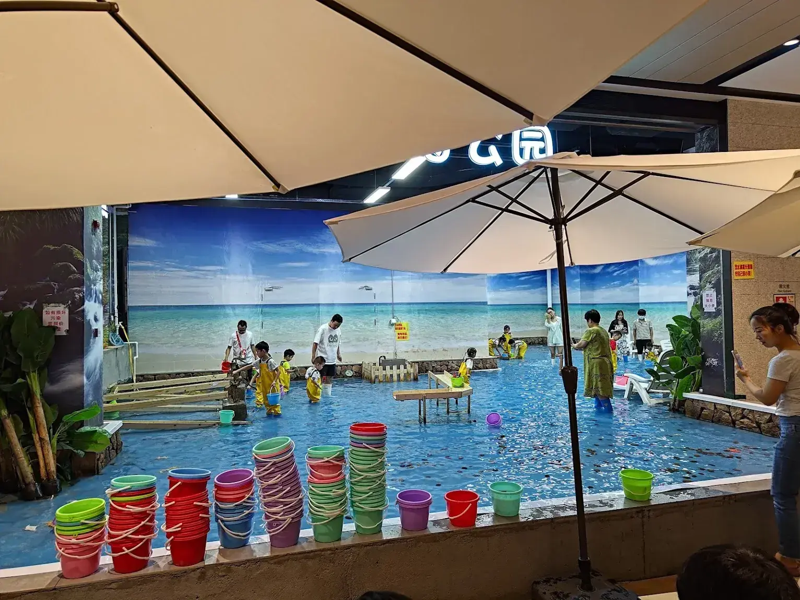

  

後來也跟視覺專業前輩有蠻多討論的，例如目前糟糕的培訓狀況其實他也有回報給上層，我們應該重實質的能力，而不是表面上的認證，但我相信這件事情大部分人的內心都明白，只是都沒有立場，只能等著看爆炸。

  

另外也有談到我未來的打算，是留下來還是離開，前者應該要跳去真的能學到實質東西的地方，實際去拿改機包操作，後者的話就是選擇簡單輕鬆的機台，混過去即可，針對更遠的未來，他也分享他的經驗，例如他是從自動化開始，到電腦視覺，再到業務，最後到業務工程師，他在當業務工程師的時候就是充分利用過去的經驗，雖然公司是做光源，但並不只是賣產品，而是要賣需求，再產生需求，客戶很少會直接要買光源，而是直接拿實際應用的產品尋求解決方案。

  

也就是說，他可以從業務的角度分析，但也有工程師的knowhow去解釋問題，讓他不只是個業務，更General的來說，固然要往更廣的應用方向去做，但也要有業務邏輯，才能讓你廣闊應用的經驗產生出獨一無二、有價值的能力，乃至於產品，簡單來說就是要有能力組合出有價值的創意。

  

另一個常聽到的就是，差勁的業務賣的是產品，普通的業務賣的是服務，厲害的業務賣的是需求，這個非常容易理解，能夠當厲害的業務沒有人要當差勁的，關鍵在於你是否有能力知道別人的痛點，去賣出有價值的服務，或是知道別人的在意的點後幫他想出更好的需求，這些都是base on你過去的經驗以及知識。

  

**第二周**

基本上負責SPA的廠商被要求在這周把產線完成，同時會有客戶來看，因此，車間裡面的主管或是AE並不想看到車間一堆閒雜人等，就算在現場也不能操作，因此就想辦法找其他有SPA的車間。

  

首先聽說龍華有設備跟導師，但是車間權限又要申請，進去之後裡面的人還是不太歡迎我們這些不速之客，簡單來說，設備的廠商不願意協助，或者說它們沒有協助的義務，後來跑到NPI產線，可能已經生產完了，所以暫時沒有任務，因此可以稍微操作一下視覺軟件，雖然相機用的都是凌雲光，但是改機前用的是思榕自己的視覺軟件，而在改機後又把視覺軟體換成凌雲光的，生產現場的大多數都是改完的。

  

在沒辦法操作的時候去找負責HAL(雷射雕刻機)的組，並且跟其他人討論，例如最基本的電路圖，像是電機、馬達由driver(伺服驅動)之間的關係，不然就是我自己在研究一些視覺的東西，因為這是我唯一看了熟悉的東西，例如：視覺標定。

  

  

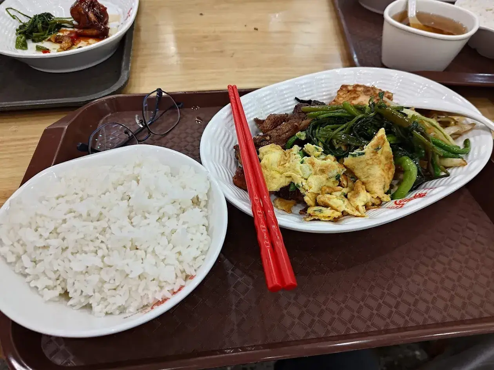

廠區內的餐廳，台灣鐵板燒 AKA 自助餐，飯有夠多，不愧是幹飯人

  

另外，因為周末要考L1的認證，其中包含筆試跟實操，可預期的是沒有導師與設備可以操作的情況下，不太可能通過實操，因此打算乾脆換一個設備學習，但在跟主管協調過後還是決定照原計畫，沒辦法通過就算了，可能要透過這樣的方式去點出問題，讓上層知道問題所在，然後再施壓下來，讓廠商配合我們。

  

幸好在考試前廠商似乎是大致調完了，因此有時間稍微介紹一下調試的SOP，也有空出一台跟我們介紹UI，主要是手動調試，包含龍門手臂的移動、相機手動拍照，吸嘴控制等，還有一些測試、標定、點位(大多點位都是人工標的例如取料放料點位、視覺標定點位，但是每個穴位猜測是有基準位後計算出來的)，另外也有主畫面的相關報警等顯示，大致跟我們過了一輪。

  

並且L1考試基本上不會考太難的，例如開機流程，最終目標是打開中控軟體進行復位，但是在開啟中控軟體以前要先打開視覺軟件才能復位，軟件開啟前要先給相機電源以及上位機電源，再給電之前要開總電源，但是要總電源開啟之後才要開汽閥，具體流程如下(感謝同事整理)

  

設備開機流程：

確認網氣電

1\. 開啟設備總電源 大電

2\. 開啟氣閥開關

3\. 開啟工控電腦(上位機)電源

4\. 開啟主控Power

5\. 打開視覺軟體

6\. 打開中控軟體

7\. 在上位機軟體內點擊“Refresh” 復位

  

設備關機流程：

1\. 在視覺軟體上點擊“停止”，“保存”, 再"退出"視覺軟體

2\. 在中控軟體內確認停止後點擊“Refresh”復位後, 再關閉中控軟體

3\. 將工控電腦關機

4\. 關閉主控Power

5\. 關閉總電源 main power

6\. 關閉氣閥開關

  

考L1筆試，講難聽就是跟鑑測一樣背答案，下班前介紹兩個新來的主管，一個經理跟一個副理，分別要在印度跟龍華，也順便跟我們來一些震撼教育，做自動化就是兩件事，「聽話」跟「服從」，希望在場的各位儘快做出決定，是否要走自動化這條路並且一路走到黑，如果不要的話盡快提出，可以去別的工作嘗試，但是目前的短期目標不變，就是通過L1、L2，針對大家對於學習環境的問題，新來的主管的回應就是如果你有心要學的話，這些都不是問題，你可以跟廠商想辦法打好關係甚至去求他教你，有心要學的話，所有遇到的困難都可以吞下去。

  

主管限我們在周一前回覆決定，我的想法是，當資訊量不足的情況下要做一個類似生死狀的意思表示，恕難從命，我想要學習、嘗試，但我沒必要賣身。

  

接著就是考L1的實操，考開關機、龍門吸嘴的XYZ移動以及壓力校正與重複性測試，第一個人只考第一項，第二個人多考第二項，以此類推，只是考官知道沒有人培訓我們，所以還不錯，還會適時教我們一些，乃至於後面教我們換料。

  

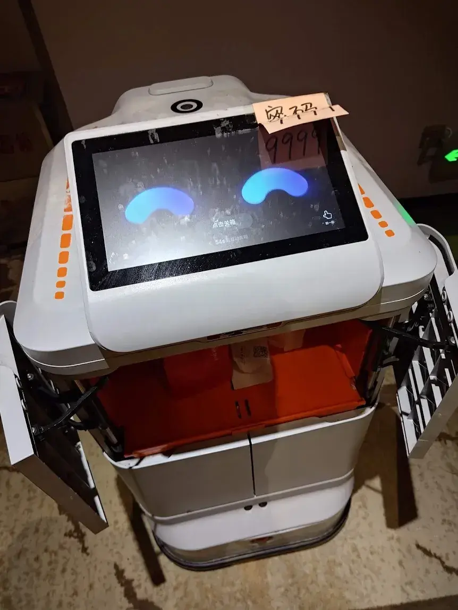

晚上叫外賣(美團)櫃台會用機器人將餐點從一樓送到門口

  

有一天在回龍華的車上跟主管有比較激烈的溝通，我認為主要是價值觀差異的討論，一開始主管問我有所求、會甚麼、想要求什麼樣的工作，為什麼值得我去做，我簡單的說了電腦圖學以及視覺的背景，主管開始口頭上考我一些基本的程式，例如指標、thread、priority，後來要考一些像是人格的問題，例如主管要吃麥當勞但是你不喜歡時怎麼辦，如果直屬主管、師傅、高層要你分別去不同地方出差要聽誰的。

  

之後就問我想問甚麼，我當然就提到我無法做明確的決定，因為資訊量不足，主管則表示不要這麼多問題，為甚麼不會先吞下去試個一年兩年，跟我談的是錢，這個未來如果做起來了公司搶著要，年薪可以上看400~500W，而我的回覆是，我認為選擇比努力更重要，只要我經過思考做出的決定我絕對百分之百願意努力，也就是說需要對我的選擇負責，因此我要審慎的選擇。

  

尤其對於「去印度」這件事做出的想法，主管認為是我們態度的問題，就是不願意吃苦努力，如果是去美國日本大家都搶著去，而我的想法是，這不只是主觀的想法也有客觀的因素，客觀上印度的風險就是較大，他的衛生、文化就是相對危險，這是大家理性思考後的結果。

  

  

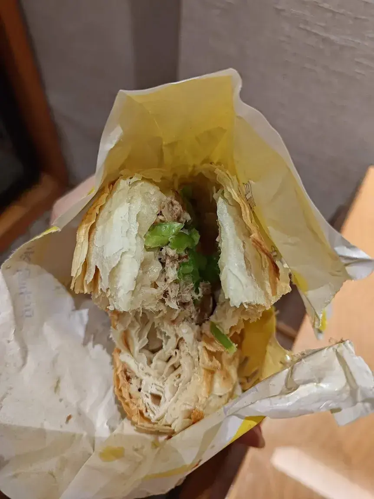  
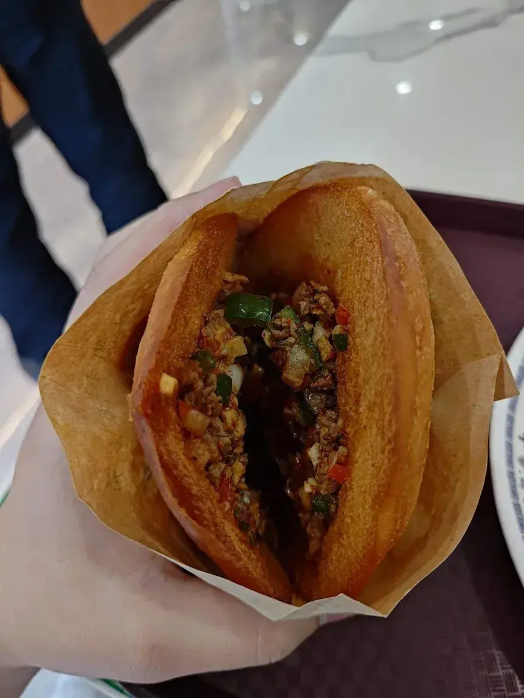  
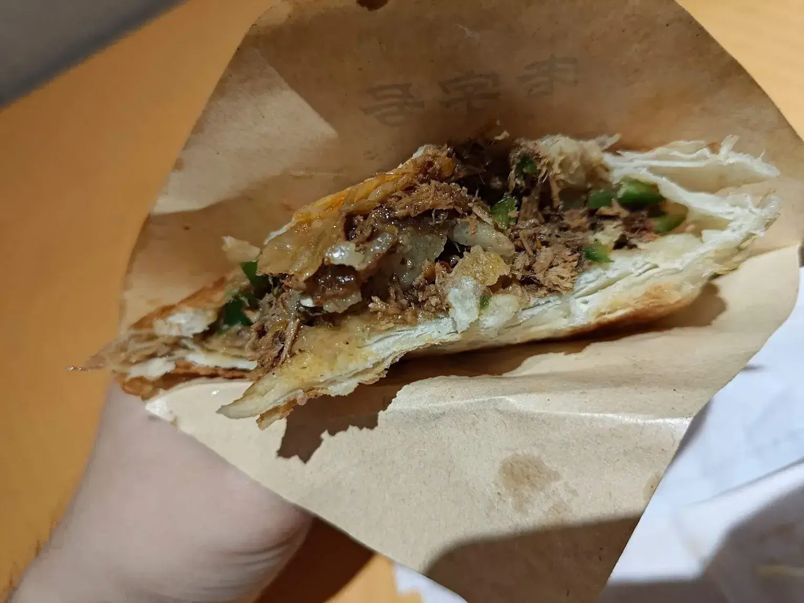

各種肉夾饃，有外面路邊攤的、餐廳賣的還有外賣的

  

其實整個過程可以感受到主管質疑我的能力，除了略顯不削的態度外，一開始就是想要找其他東西來壓我一頭，例如問我的學歷，可能想藉由我是爛學校或是文組來證明我的想法不切實際，抑或是問我當兵是四個月還是一年來證明我的想法是沒有歷練過的，應該要學會乖乖聽話，只要努力就好，但是在知道我是台科資工所畢業的後，就直接地圖炮，認為是現在新一代的年輕人總是毛毛躁躁，不願意埋頭苦幹，問題一大堆，我的答案是，我希望儘量去拋出問題來排除疑慮，而不是懵懵懂懂的下重大的決定，這或許是我們這一代人能夠選擇，而過去不行，也或許只是我對資訊、知識的渴望，我當然願意努力，但我要慎重。

  

說真的，我完全可以理解主管想要表達甚麼，但是這是價值觀的衝突，兩方的價值觀沒有對錯，而是在不同的時空環境下產生出來的，只是我有種以後我在這個主管的眼中會黑掉的感覺w。

  

  

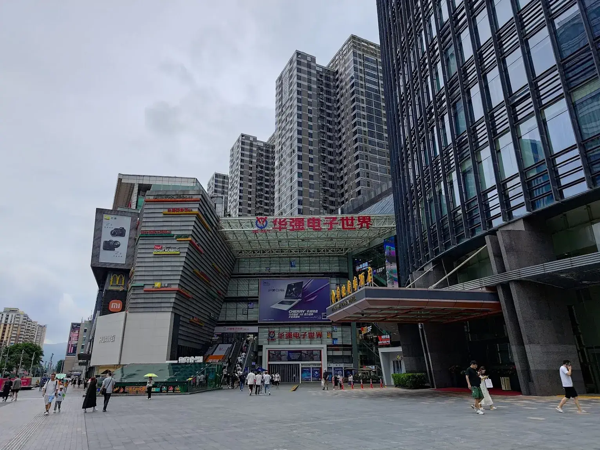

趁著假日跑去華強北，基本上就一整條的光華商場，只是裡面的東西的同質性蠻高的，例如藍芽耳機或是一些3C產品，而且總有一種我是韭菜的感覺，所以甚麼都沒買。

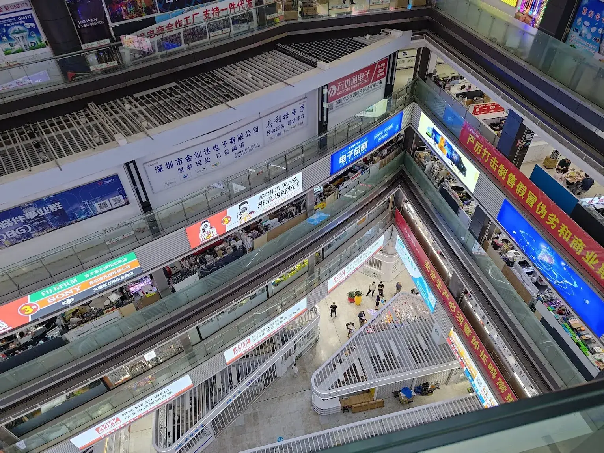

  

會去華強北主要是因為本來想去漫展什麼的，但是不巧甚麼都沒碰上，因此去個主管推薦的地方，而且感覺中國真的是宅宅沙漠，甚麼宅店都沒有，所以最後就隨便找個影院體驗一下，套餐是脆薯配可樂，但與其說是脆薯不如是放大版的卡迪那。

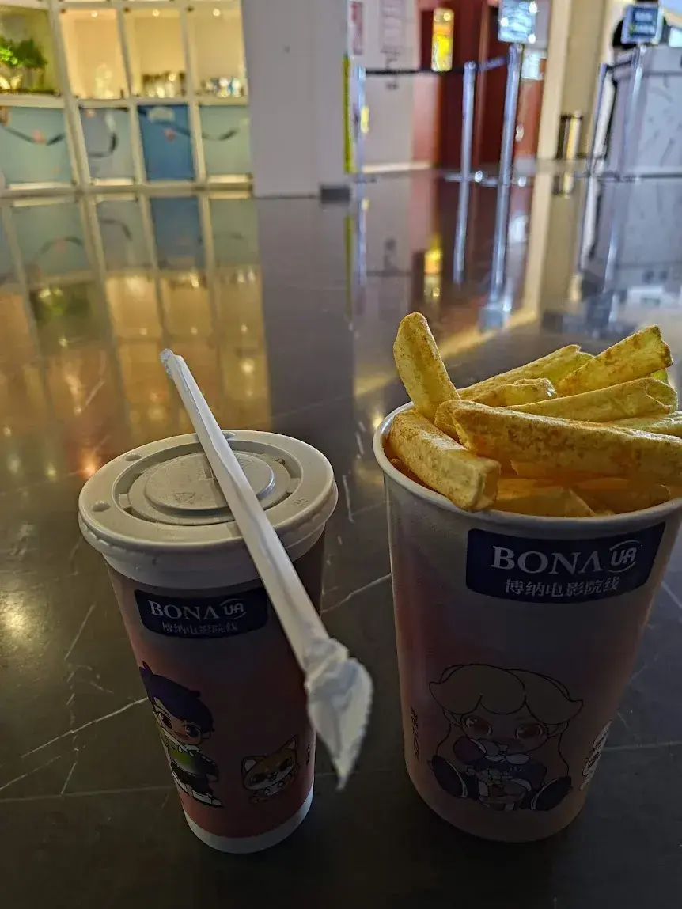

  

  

這周結束前，因為下周要準備考L2，因此主管又要求開復盤會議，會議中確認L2是考架線的概念，L3才是操作，同時意味著認證與實際能力無關，只不過是上層要求的KPI罷了，換句話說，我們仍然要考過，有鑑於大家都沒把握，主管提議延一周考，聽說是因為最多只能考兩次，但是對我來說，這周就算考不過，下周可以補考就算都考不過，那就考不過，結果就是L2通過後回台灣，反過來說就是沒有通過就回不去，直到表定出差結束的時候。

  

**第三周**

基本上都在準備考L2，預計L2考過可以回台休息一周，也要決定是否要去印度，預計在這邊滿一個月就會搬去觀瀾配合改機與加班，然後出差結束日回台兩周，平常練習就去考L1的那台設費練習軟體方面，因為那邊似乎目前沒有任務，只是那位當時那位考官不在，只有另一位廠商在，雖然不會所有的東西，但是還是能加減問，也有操控到舊版本的設備，有廠商自己的視覺軟件。

  

至於硬體方面就是進改機間看廠商改設備，主要是針對機構的改良，例如理解壓力儀表要調整的項目、換飛達(feeder)、相機、光源等，缺點是都沒有接電，所以不能操作，但是優點是可以碰想看的部分。

  

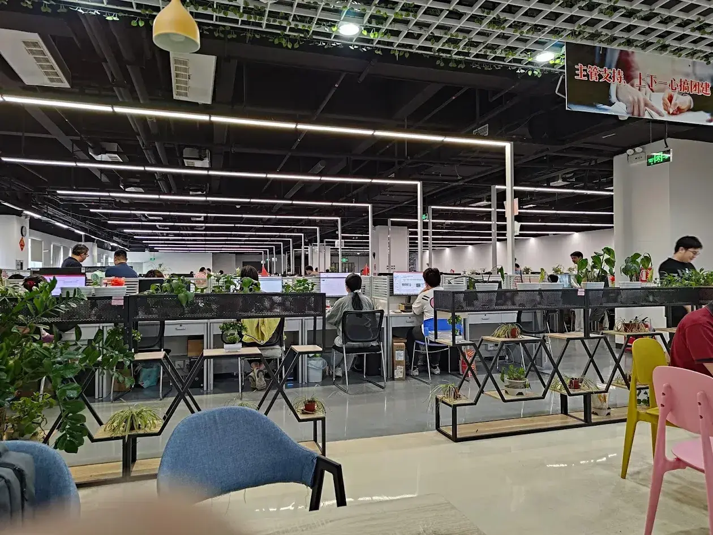

應該算是軟體工程師的工作環境，當然與我無關

  

因此會接機台的視覺改機包，主要就是上下視覺的相機、鏡頭、光源支架，在替換的過程也會需要拔傳輸線與電源線，另外是改飛達的光纖，包含不沾板, 光纖板, 光纖板安裝墊板, 0.5mm光纖，雖說講白了就是鎖螺絲跟插線，但是最後還是廠商示範一次才比較理解，包含理線，光纖如何插入等，因為都沒有SOP或是爆炸圖，只有清單明細而已，因此只能先觀摩。

  

由於在現場有可以實際動手的硬體了，因此主管跟我們講解怎麼了解一個機台的SOP，先畫初頁把機台重要的幾個模組用示意圖畫出來，然後把模組的控制器的型號抄起來，最後開始去理解動作流程，並且將初頁中不同模組畫得更詳細，包含如何接線、如何控制，例如有幾個sensor放在哪裡，汽缸要怎麼擋住料，諸如此類有關於電控的流程，事實上，機構電控不分家，雖然一開始機構的工程師會給出大致的流程，但是細節仍需要電控自己去設計。

  

至於大機台與小機台的差異主要是相關模組大小的關係，例如因為新的飛達都比較大，因此小機台塞不進去，因此只能坐在大機台上，也就是這與料的大小無關。

  

畫完初頁後就可以畫比較詳細的架構圖，主要是不同模組的layout以及連接關係，針對個別模組畫比較詳細的示意圖，例如輸送帶上的sensor、馬達，乃至於啟動條件與整個流程。

  

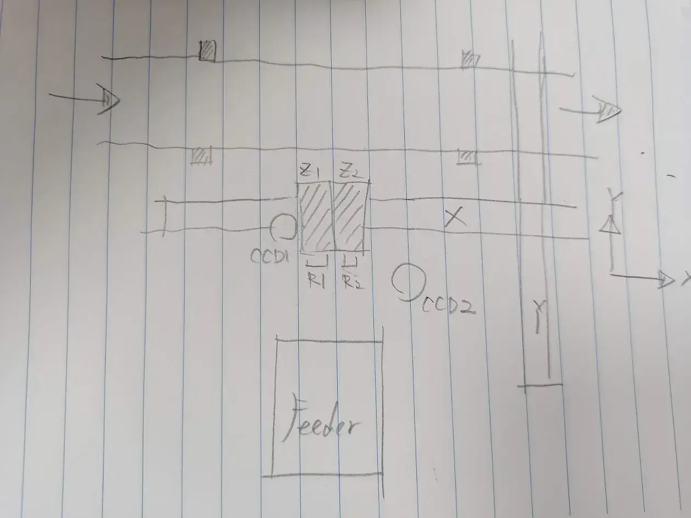

初頁示意圖

  

在接近考試的時候，主管又找我們去小房間，問問是否要要去印度，我的答案雖然是不一定，主管一臉覺得不耐煩，我的理解是，從公司的角度不可能再多放資源給這種不確定性上，因此主管也就認定是不去了(中間也有提到父親的原因，他直接說回去父親身邊吧w)，然後繼續畫大餅，會PLC有月薪有2w RMB，會寫PC視覺有5W RMB，另一種方向是接線，一條線可以拿40元台幣，一台總有個幾百條。前者甚至在台灣也有些工作室可能就是包一台設備的軟體在賺錢的。

  

最後是主管對我的一些感想，首先他很驚訝現在的年輕人的思想跟過去不同，過去不會跟父母討論，有工作先做，服從就對了(4個月不算當兵zz)，然後是認為我應該是在優渥的環境下長大的，可能是覺得我的毛很多，最後也覺得我有點固執，但我想鑽牛角尖就是RD的宿命吧。

  

主管感覺想讓氣氛輕鬆，但是又一直在教育我們，然後又是句點王，氣氛就比較沉重，我一直想要救場子，但是感覺話就很多ww

  

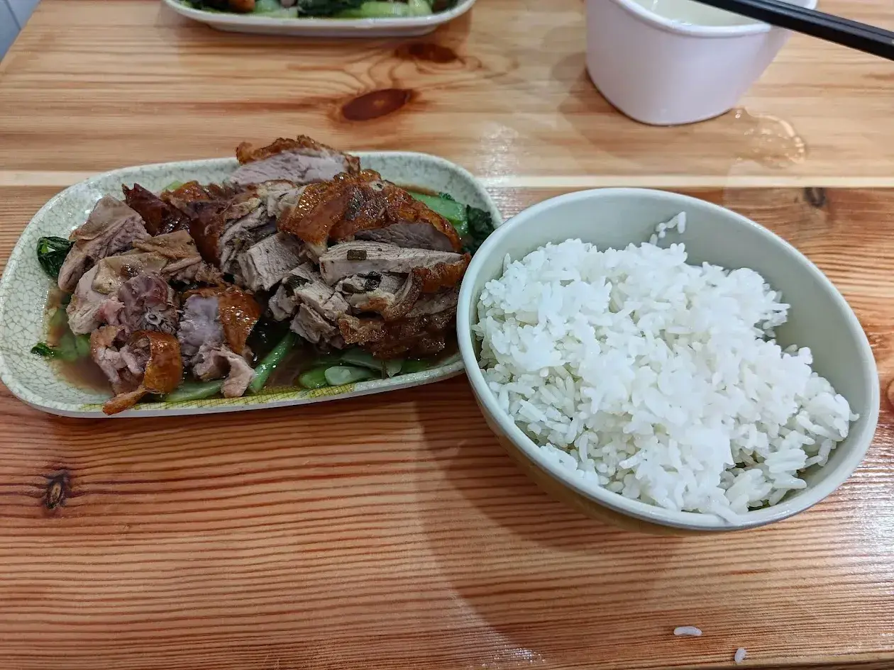

燒鴨很多的燒臘，我是買15RMB的，換算大約70元。

  

筆試一如既往背答案，考實操時間到了但沒等到廠商的考官，所以又走到改機間找廠商，結果他們說剛派一個人去了，因為懶的走過去了，所以直接在改機間考，但是改機間的軟體基本上都還沒準備好，因此就拿L2的理論試卷考，我是考為什麼會吸不起料 (負壓不夠，可能是氣管有問題，也有可能是吸嘴壓下去太用力，導致泡棉黏的更牢所以吸不起來)、相機IP設置、光學限位器。

  

雖說要認證，但是大多數人也知道就算沒過也不會改變甚麼，因為既然被判斷為不去印度，那麼公司沒必要把你多讓你出差一天，因為每一天除了房間費用之外也有每天250RMB的津貼。

  

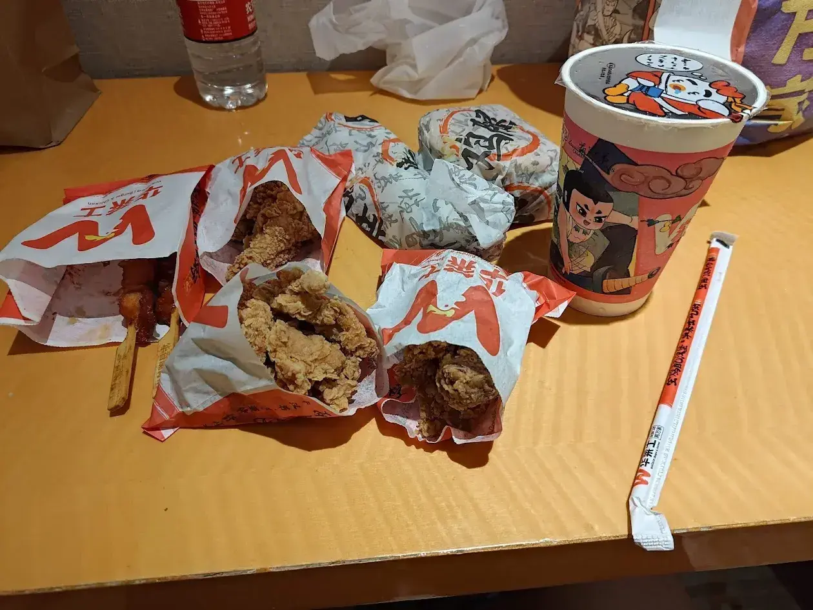

離開前爆吃九件套，價格大概跟台灣的XL套餐差不多

  

比較有趣的是，因為基本上處於待退狀態，所以都在跟越幹做英文會話，這趟去中國講的英文比去美國還多，但主要是兩方都不太標準，所以都會想辦法用簡單的單字去試圖讓對方理解，雖然偶爾還是會聽不懂(當然也有口音問題)，會用寫的或是翻譯，但整個溝通的過程比較沒有壓力。

  

所以也有在幫忙越南同仁，因為他們想要換比較優惠的sim卡方案，所以為了等店員只好去旁邊luckin車間(AKA 瑞幸咖啡)消耗時間，只是之後發現如果不是中國人的方案只有36元的跟99.5元的，分別是6G跟150G，完全沒有比較適中的方案，因此最後甚麼都沒辦，白白浪費一個上午。

  

另外在改機間時，也會跟越幹用英文聊很多，例如越南的兵役似乎是2年，但是他父母有塞錢，所以不用當，主要是塞的錢加上當兵的薪水少於這兩年出去工作能賺的。另外他前一份工作是在三星，似乎越南的日韓企業蠻早就布局的，所以蠻大但是近年有在下滑，雖然他是大學學自動化畢業，但是薪水大概就只有22K的水準，另外也有稍微教他一些中文，因為主管的英文聽起來比我還要糟，所以越幹事必是需要會一些中文的。

  

  

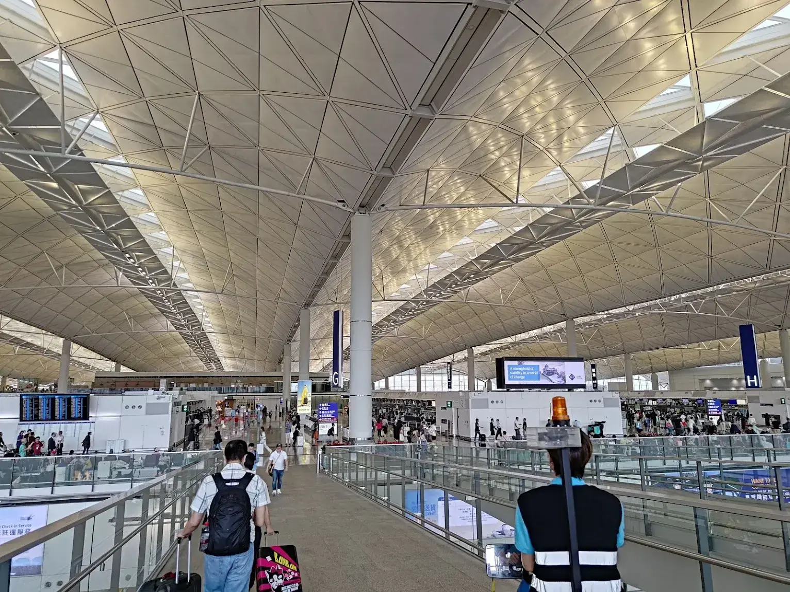

香港機場

  

返台前一天，基本上沒事幹，主管也讓我們中午過後就可以回酒店了，因此上午在改機間做最後的交接，其實就是把筆記寫的東西分享出來而已。之後中午跟越幹吃完最後的午餐就回龍華了。

  

另外也有跟過去擔任QA的同事聊過去在專案上的經驗，例如，QA困難點在於怎麼設計出好的測試，這通常要與客戶與RD溝通，前者很好理解，就是依據需求想怎麼設計測試可以確認需求可以被驗證，因此一定程度上要跟客戶溝通，後者因為跟我的經驗比較有關，所以可以比較詳細的問，理論上，QA應該把RD的東西當作黑箱來測，但是實務上，QA還是一定程度上需要了解RD做了甚麼才能有效的測試，因此就變得有點像是白箱。而我的理解是，QA應該負責的是整合測試，RD要自己寫單元測試，同事要有PM來協調兩者，讓QA不需要知道實作細節就能有效測試。

  

因為實務上的情況，QA會認為自己只是不會上code而已，因為他們一定程度上相當了解如何算法，只是不會真的實作而已，因此或許真的去學學看程式，但這就是一個大問題，因為選擇有很多，大學、補習班、工研院等等，但是從我的角度沒辦法給答案，因為我是從學術體系出來的，所學扎實但未必符合別人的需求。

  

就如同視覺前輩講的，視覺這塊基本上傳統算法還是相當重要，一定程度上不需要那些前沿的科技，實際上軟體中的流程一來受制於機構、電控人員的理解，一方面也受制於無法預知實際生產會發生的問題，因此流程上一定都是修修補補，基本上就是經驗跟Trial and Error。

  

  

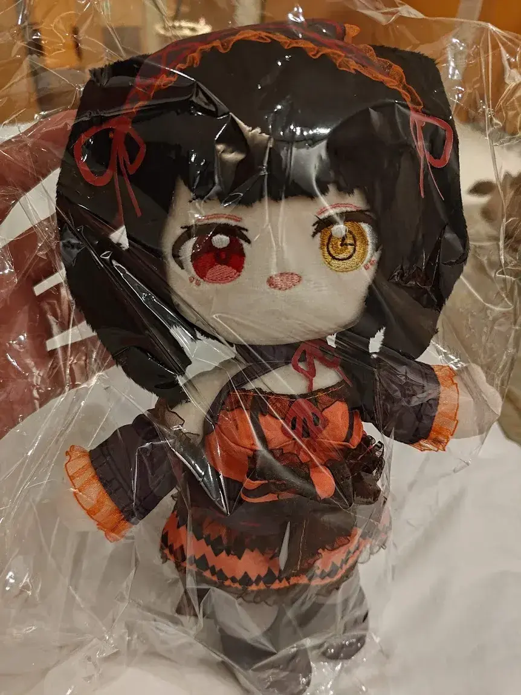

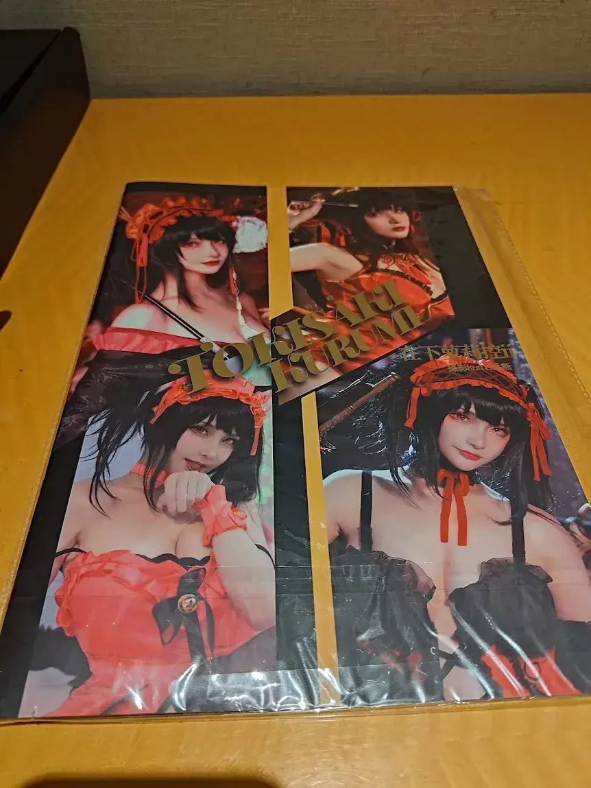

淘寶買狂三，分別是30CM的布偶跟魔王寫真

  

事實上，公司這邊過去不是專門作設備的，但最近有去印度改機的機會，因此想以此為契機，如果表現好，或許可以從改機、維護的廠商轉變為設備供應商，但現實很骨感，人才，或者對公司來說是人員，我們就只是資源，一條產線就是配多少人力資源，因此我們的背景不重要，一切事情都有辦法透過培訓來學習，只要給定時間，你就應該要會，因此也沒有所謂的知識累積的概念，因為本質上他們是科技業、製造業，不是靠知識來賺錢的。

  

總而言之，這整件事情就我們的立場，我們只是勞工，轉調來這邊沒有讓我們選擇的機會，甚至有傳聞說整件事情在轉調發生前一個月就已經規劃好了，目標就是要把我們全部送去印度，只是在轉調會議的時候不明講，一定程度上會感受到先把你騙進來的感覺，因為你進來之後公司要把你塞去哪你基本上也只能接受，因此從出差來這邊都是且戰且走，何況朝令夕改，我們只能把每天該做的事情做好，因此我認為我基本上都有配合公司的安排。

  

**後話**

回台大概過了一個月，也就是在當初設定好的出差結束日，許多人出差回來休息，我也稍微問了一下狀況，可能是剩下來的人確定會前往印度，因此培訓的狀況的確有改善，整件事情由其他單位來支援，因此就有比較完善的訓練，至少該碰的會碰到，不懂的能問，但同時考試甚麼的也就更加實務，不會像之前那樣隨便，套一句中國的同事說的

  

打工拿的錢是你應得的，打混拿的錢是你賺的

  

另外，因為我們無法達成去印度的目標，因此主管個別約談我們，表示給兩星期時間外轉，也就是兩周內如果有找到鴻海集團內其他職務的話，處長會放人，沒找到的話目前還不知道，講難聽一點就是這個處不要我們了，想辦法找人收留，事實上，鴻海集團也包含前公司，只是前公司的狀況更糟了，過去待的AI team直接解散，幾乎全數資遣，據說是AI team本來就不是外資這邊要成立的，而是公司自己想搞得，所以當然會先砍這邊，雖然與其他公司的案子要繼續，但是所有研發技術人員都離開了，我對於這個專案相當悲觀，另外謠傳公司目標是8成印幹，2成台幹，總之，目前所有人都自身難保，根本不可能有我進去的空間。

  

剩下就是打開104搜尋職缺或者是提供CV給人資幫忙媒合，除此之外，我們無能為力，後來人資也只有問說去越南做設備有無興趣，但我還是希望做軟體領域的，所以也就沒有下文了，兩周後大多數有人脈的都轉出去了，只剩我和少數人沒人要，基本上公司也拿我們沒輒，基本上能動用的手段就是把我們考績打0分，並且進一步威脅可能會導致獎金出問題，而處理這些勞資糾紛就等一切告一段落再說吧。

$('article.c-text img').load(function () { // 表格內圖片大於表格寬時，設為 100% if ($(this).parents('table').length != 0) { if ($(this).width() >= $(this).parents('td').width()) { $(this).width('100%'); } else { $(this).width($(this).width() + 'px'); } } });
